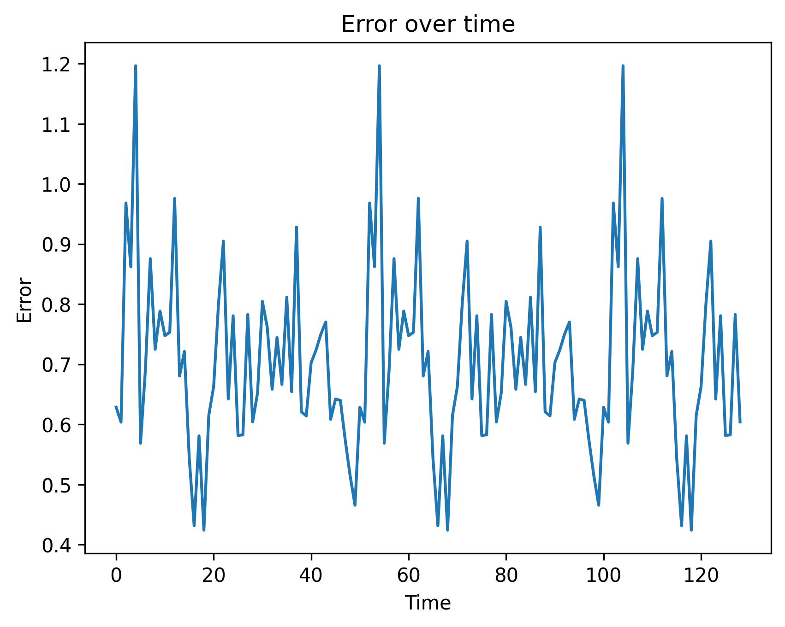
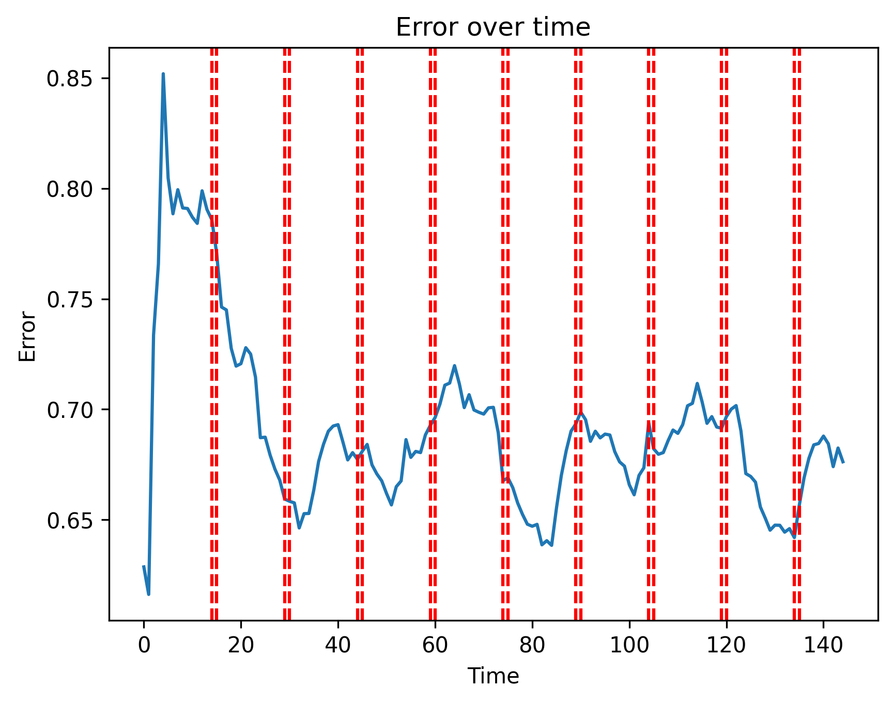

## Overview
Online data traffic depends on a large number of factors and can't be easily predicted. Trends that occur in data loads depend on a lot of factors, and might change with time. By making use of VNFs and SDN architecture, we can optimize the resource usage given information such as expected traffic at any given time. This project aims at making that possible

## Why is it needed
- Resources come in limited supply, especially when running on the edge
- By predicting the amount of traffic that is expected at any time slot, we are able to spin up or shut down the amount of VMs we are running, to suite the incoming traffic.

## Challenges faced
- It is near impossible to predict the amount of traffic that might be incoming at any point in time.
- There are lots of factors affecting this, including the time period, location, type of server, etc.
- Even if a trend was noticed, and a model can be used to train on, we face yet another issue in the form of `data drifts`. 
- Data drifts occur when the variance of a dataset changes with time, and what might be correct now won't be correct in a later time.

## What is achieved in this project
- This project aims to use the principle of online learning on the following example situation.
- Consider an edge computing system, which is running inference using a relatively big model.
- This model, (let's name it `Main Model`) is static and won't be subjected to any `data drifts`
- The edge runs another model (let's name it `Online Model`) that predicts the amount of traffic that might occur in the next time slot, and creates / deletes containerized versions of the `Main Model` to fit the amount of expected traffic.
- The `Online Model` makes prediction, but also keeps track of it's accuracy over time by comparing it's own predictions to the actual seen data and then when a specific time-window has passesd / when accuracy falls off below a threshold, it initiates retrained on the actual seen data.

## Results achieved

(a) model without retraining

(b) model with retraining

## References
- [Efficient Online DNN Inference with Continuous
Learning in Edge Computing](https://www.semanticscholar.org/paper/Efficient-Deep-Learning-Inference-on-Edge-Devices-Jiang-Chen/d2f07fd189a1b3c37e42aff9d0345f8ee4f87135)
- [Caravan](https://www.usenix.org/conference/osdi24/presentation/zhang-qizheng)